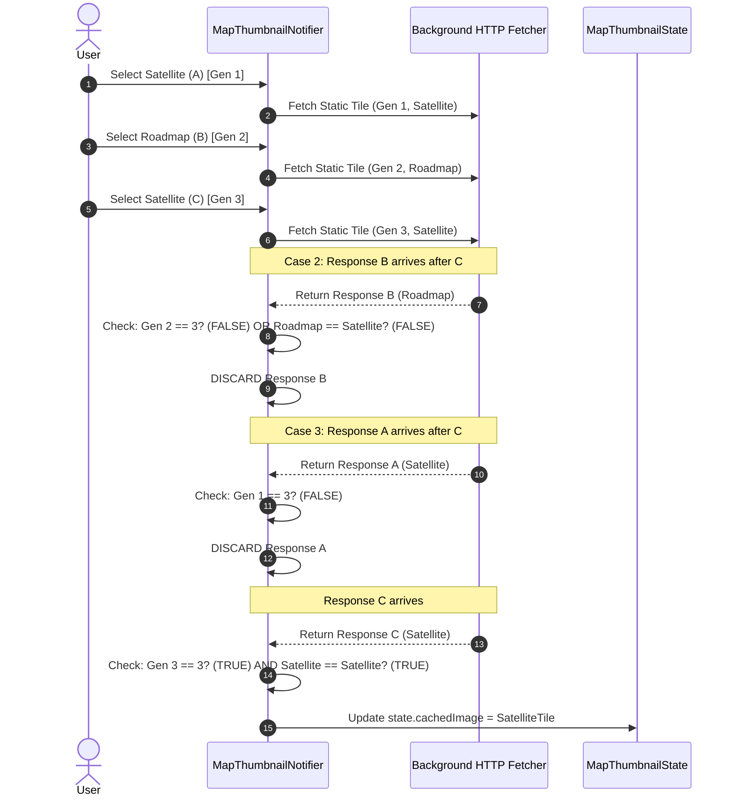
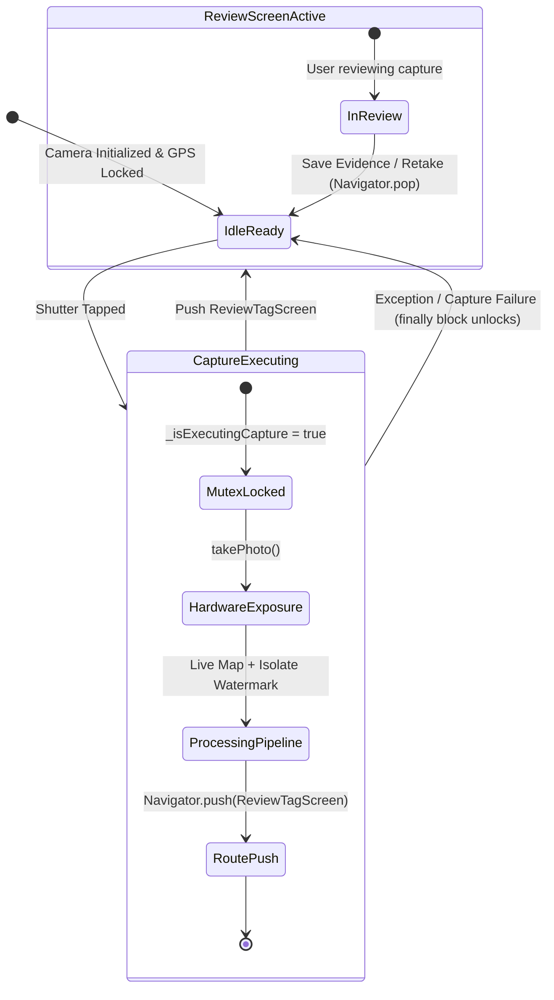

# SiteLens — Remediation Design Review (F1, F2, F3)

**Document Type**: Engineering Remediation Specification & Architectural Design Review  
**Status**: DRAFT FOR USER APPROVAL (Strictly Read-Only Phase — No Code Modified)  
**Target Repository**: `~/workspace/products/SiteLens`  
**Protected Baseline**: Commit `6a02f91` on `main` (`v1.0.0` protected tag)  
**Governing Mandate**: Governing Rule 5 (Evidence Integrity)  

---

## Executive Summary

Following the read-only audit documented in `docs/handover/E2E_RELIABILITY_AUDIT.md`, this design review establishes the minimal, surgical remediation specification for the three core reliability findings:
1. **F1 — Shutter Timestamp Overwrite by Stale GNSS Satellite Fix** (`CONFIRMED LOGICAL DEFECT`, Release-Blocking)
2. **F2 — Minimap Cache Poisoning via Stale Background Static Map Response** (`CONFIRMED LOGICAL DEFECT`, Release-Blocking)
3. **F3 — Shutter Button State Machine Re-Entrancy Hazard** (`LIKELY RACE CONDITION`, Release-Blocking Risk)

This document provides:
* A finding-by-finding technical assessment answering all 14 mandatory review criteria.
* The formal separation of **Capture-Time Authority** from **GNSS-Fix Authority** (F1).
* The **Generational Invariant and State Machine** for asynchronous minimap acquisition (F2).
* The **Shutter State Machine Analysis and Atomic Capture Mutex** (F3).
* The **Cross-Finding Evidence Transaction Boundary Invariant**.
* A minimal file modification plan (zero speculative abstractions).
* Exhaustive automated and physical-device test criteria.
* Release impact and scope control boundaries.

---

## 1. Finding-by-Finding Assessment

---

### Finding 1 (F1): Shutter Timestamp Overwrite by Stale GNSS Satellite Fix

* **Classification**: **CONFIRMED LOGICAL DEFECT**
* **Release-Blocking**: **YES** (Direct breach of Governing Rule 5 — Evidence Integrity)

#### 1. Exact Source Files & Methods
* `lib/features/camera/camera_screen.dart`: Method `_executePhotoCapture()` (lines 580–612).
* `lib/features/camera/models/evidence_metadata_snapshot.dart`: Factory constructor `EvidenceMetadataSnapshot.capture()` (lines 58–118).
* `lib/features/camera/controllers/gps_hardware_controller.dart`: Method `getBestRecentPosition()` (lines 208–223).

#### 2. Current Execution Path
$$\begin{aligned}
\text{Shutter Press } (T_0) &\longrightarrow \text{CameraScreen._executePhotoCapture()} \\
&\longrightarrow \text{bestPos} = \text{gpsNotifier.getBestRecentPosition(window: 5s)} \\
&\longrightarrow \text{effectiveGps} = \text{gpsHardware.copyWith(timestampUtc: bestPos.timestamp.toUtc())} \\
&\longrightarrow \text{EvidenceMetadataSnapshot.capture(gpsState: effectiveGps)} \\
&\longrightarrow \text{captureUtc} = \text{gpsState.timestampUtc ?? nowUtc} \\
&\longrightarrow \text{capturedAtUtc} = \text{captureUtc (static satellite fix instant, up to 5s old)} \\
&\longrightarrow \text{canonicalTimestampUtc} = \text{DateFormat.format(capturedAtUtc)} \\
&\longrightarrow \text{Burned into JPEG vector HUD watermark} \\
&\longrightarrow \text{Written to SQLite } \texttt{media.captured\_at}
\end{aligned}$$

#### 3. Current State Ownership
* `GpsHardwareController` owns the sensor position stream and 5-second fix history buffer (`_recentPositions`).
* `CameraScreen` extracts `bestPos` and overwrites `effectiveGps.timestampUtc` with the fix measurement time.
* `EvidenceMetadataSnapshot` prioritizes `gpsState.timestampUtc` over the local `nowUtc` instant generated at capture time.

#### 4. Smallest Architectural Boundary for Correction
The defect must be corrected at the boundary between **Physical Shutter Actuation** and **Metadata Snapshotting**:
1. In `CameraScreen._executePhotoCapture`: Capture `final shutterInstantUtc = DateTime.now().toUtc();` at the exact instant $T_0$.
2. In `EvidenceMetadataSnapshot.capture`: Pass `shutterInstantUtc` as the immutable physical capture timestamp.
3. Decouple `capturedAtUtc` from `gpsState.timestampUtc`:
   - `capturedAtUtc` $\equiv$ `shutterInstantUtc` (The physical exposure instant).
   - `gpsState.timestampUtc` $\equiv$ Retained strictly as GNSS satellite fix measurement time (`gnssFixTimestampUtc`).

#### 5. Preservation of Existing Behavior
* Preserves single-capture behavior completely. Modern smartphone system clocks are disciplined by cellular/NTP synchronization to within $<50\text{ms}$ of UTC.
* Eliminates the multi-capture collision defect where 3–4 rapid shots share an identical historical satellite second.

#### 6. Effect on Persisted Evidence Semantics
* **Positive forensic enhancement**: Restores truthfulness. `captured_at` in SQLite will accurately record when the physical photo was taken.
* Schema remains unchanged (`TextColumn captured_at` in Drift).

#### 7. Required Automated Tests
* Unit test in `test/unit/evidence_metadata_snapshot_test.dart`:
  - Pass a `GpsHardwareState` with `timestampUtc` set to 4.5 seconds in the past.
  - Assert that `snapshot.capturedAtUtc` is within $100\text{ms}$ of `DateTime.now().toUtc()` and strictly NOT equal to `gpsState.timestampUtc`.
* Rapid multi-capture test:
  - Generate 3 snapshots 500ms apart with an identical static `gpsState`.
  - Assert that $T_1 < T_2 < T_3$ with distinct formatted seconds/milliseconds.

#### 8. Required Physical-Device Tests
* On Motorola edge 50 fusion: Take 3 rapid photos within 2 seconds.
* Verify via on-screen HUD, gallery detail view, and SQLite inspection that each photo possesses a distinct, monotonically advancing timestamp.

#### 9. Required Regression Tests
* Run full 489-test suite.
* Update `evidence_metadata_snapshot_test.dart:18` (which previously asserted that `snapshot.canonicalTimestampUtc` mirrored the mock GPS timestamp).

#### 10. Potential Side Effects
* If a device has an un-synced manual clock (e.g. set by user to year 2010), EXIF and watermark will reflect the system clock. This matches standard Android OS camera behavior.

#### 11. Migration & Backward Compatibility
* Zero database schema migration required. Existing database rows remain immutable.

#### 12. APK Rebuild Required
* **YES**.

#### 13. Production Deployment Required
* **NO** (Client-side only).

#### 14. Evidence Proving Fix is Correct
* A burst of 3–5 rapid physical captures displaying distinct, monotonic timestamps on both the burned HUD and SQLite.

---

### Finding 2 (F2): Minimap Cache Poisoning via Stale Background Static Map Response

* **Classification**: **CONFIRMED LOGICAL DEFECT**
* **Release-Blocking**: **YES** (Watermark imagery corruption)

#### 1. Exact Source Files & Methods
* `lib/features/camera/controllers/map_thumbnail_controller.dart`: Method `_fetchStaticImageInBackground()` (lines 162–182).
* `lib/features/camera/camera_screen.dart`: Lines 650–675 (fallback cached tile consumption).

#### 2. Current Execution Path
$$\begin{aligned}
\text{User toggles Satellite } \rightarrow \text{ Roadmap} &\longrightarrow \text{\_fetchStaticImageInBackground(..., Roadmap) launched} \\
\text{User immediately toggles Roadmap } \rightarrow \text{ Satellite} &\longrightarrow \text{state.mapType = Satellite; \_mapTypeGeneration increments} \\
\text{Roadmap HTTP response arrives late} &\longrightarrow \text{\_fetchStaticImageInBackground completes} \\
&\longrightarrow \text{state = state.copyWith(cachedImage: roadmapImage) [NO GEN CHECK]} \\
&\longrightarrow \text{state.cachedImage holds Roadmap bytes while state.mapType is Satellite} \\
\text{Subsequent Capture (live map timeout)} &\longrightarrow \text{CameraScreen reads mapThumbnailState.cachedTile} \\
&\longrightarrow \text{Checks: mapThumbnailState.mapType == currentMapType (both Satellite)} \\
&\longrightarrow \text{Roadmap tile burned into HUD labeled SATELLITE}
\end{aligned}$$

#### 3. Current State Ownership
* `MapThumbnailNotifier` owns `MapThumbnailState` and already maintains `_mapTypeGeneration`.
* However, `_fetchStaticImageInBackground` runs an uncoordinated background `Future` that mutates `state` without checking `_mapTypeGeneration` or `state.mapType`.

#### 4. Smallest Architectural Boundary for Correction
Inside `MapThumbnailNotifier._fetchStaticImageInBackground()`:
1. Capture `final requestGen = _mapTypeGeneration;` and `final requestMapType = mapType;` synchronously before the async gap.
2. Upon return from `_service.getOrFetchStaticMapImage`:
   ```dart
   if (!mounted || requestGen != _mapTypeGeneration || state.mapType != requestMapType) {
     return; // Discard stale, superseded result
   }
   ```

#### 5. Preservation of Existing Behavior
* Valid, timely static map fetches for the currently active map type continue to populate the cache as intended.
* Stale network responses from superseded map selections are silently dropped.

#### 6. Effect on Persisted Evidence Semantics
* Guarantees that burned minimap imagery strictly matches the declared map layer (Normal vs Satellite).

#### 7. Required Automated Tests
* Unit test in `test/unit/map_thumbnail_service_test.dart`:
  - Dispatch a simulated `_fetchStaticImageInBackground` for `Roadmap` with a delayed completer.
  - Call `handleGpsUpdate(mapType: AppMapType.satellite)`.
  - Complete the delayed `Roadmap` completer.
  - Assert that `state.cachedImage` is NOT set to the roadmap image.
  - Assert that `state.mapType` remains `AppMapType.satellite`.

#### 8. Required Physical-Device Tests
* Rapidly toggle `Satellite → Roadmap → Satellite` 5 times within 2 seconds.
* Immediately trigger a photo capture under network throttling (forcing live snapshot timeout to engage Tier 2 fallback).
* Inspect the burned watermark to verify the tile is authentic Satellite imagery.

#### 9. Required Regression Tests
* Existing `gps_map_thumbnail_test.dart` and `minimap_evidence_provenance_test.dart` must pass.

#### 10. Potential Side Effects
* None. Dropping an obsolete HTTP response is the canonical state-machine pattern.

#### 11. Migration & Backward Compatibility
* None required.

#### 12. APK Rebuild Required
* **YES**.

#### 13. Production Deployment Required
* **NO**.

#### 14. Evidence Proving Fix is Correct
* Zero instances of roadmap vector tiles appearing under the "SATELLITE" label in automated stress tests and physical device testing.

---

### Finding 3 (F3): Shutter Button State Machine Re-Entrancy Hazard

* **Classification**: **LIKELY RACE CONDITION**
* **Release-Blocking**: **YES** (Substantial release risk — requires verification test before remediation)

#### 1. Exact Source Files & Methods
* `lib/features/camera/controllers/camera_hardware_controller.dart`: Method `takePhoto()` (lines 270–290).
* `lib/features/camera/camera_screen.dart`: Methods `_handleShutterPressed()` (lines 357–364) and `_executePhotoCapture()` (lines 580–760).
* `lib/features/camera/widgets/camera_shutter_station.dart`: Lines 32–36 (`isShutterDisabled` evaluation).

#### 2. Current Execution Path
$$\begin{aligned}
\text{User taps Shutter} &\longrightarrow \text{CameraHardwareController.takePhoto()} \\
&\longrightarrow \text{state = state.copyWith(status: CameraStatus.capturing)} \\
&\longrightarrow \text{Raw picture taken by CameraX hardware (~200ms)} \\
&\longrightarrow \text{\textbf{finally} block: state = state.copyWith(status: CameraStatus.ready)} \\
&\longrightarrow \text{\textbf{isShutterDisabled becomes FALSE in UI}} \\
\text{Gap: 1,000ms–2,500ms} &\longrightarrow \text{CameraScreen continues live map await, isolate watermark, SHA-256} \\
\text{User taps Shutter AGAIN} &\longrightarrow \text{Second \_executePhotoCapture() begins concurrently!} \\
&\longrightarrow \text{Two isolate jobs compete; duplicate ReviewTagScreen routes pushed}
\end{aligned}$$

#### 3. Current State Ownership
* `CameraHardwareController` only tracks the native camera sensor status (`takePicture`), NOT the full evidence processing lifecycle.
* `CameraScreen` maintains no local capture mutex or atomic execution state.

#### 4. Smallest Architectural Boundary for Correction
In `CameraScreenState`:
1. Introduce an atomic capture lock: `bool _isExecutingCapture = false;`
2. At the entry of `_executePhotoCapture`:
   ```dart
   if (_isExecutingCapture) return;
   setState(() { _isExecutingCapture = true; });
   try {
     ...
   } finally {
     if (mounted) {
       setState(() { _isExecutingCapture = false; });
     }
   }
   ```
3. Pass `_isExecutingCapture` to `CameraShutterStation` to keep the shutter button physically disabled and visually locked until `ReviewTagScreen` is launched or an error occurs.

#### 5. Preservation of Existing Behavior
* Single captures operate with zero latency penalty. Rapid multi-taps are debounced cleanly at the presentation boundary.

#### 6. Effect on Persisted Evidence Semantics
* Prevents race conditions from generating duplicate or conflicting evidence records.

#### 7. Required Automated Tests
* Widget test in `test/widget/camera_screen_test.dart`:
  - Tap shutter button.
  - Before the isolate/processing future resolves, inject a second tap event on the shutter widget.
  - Assert that `takePhoto()` was called exactly once.
  - Assert that only one `ReviewTagScreen` is pushed onto the navigator.

#### 8. Required Physical-Device Tests
* Perform rapid triple-tap on the physical shutter button on Motorola edge 50 fusion.
* Verify that only one shutter animation plays, only one capture is processed, and exactly one review screen appears.

#### 9. Required Regression Tests
* Verify timer countdown capture still works.
* Verify video recording toggle is not affected.

#### 10. Potential Side Effects
* If an unhandled exception escaped `_executePhotoCapture` without a `finally` block, the shutter button could lock. Wrapping in `try ... finally` guarantees lock release.

#### 11. Migration & Backward Compatibility
* None.

#### 12. APK Rebuild Required
* **YES**.

#### 13. Production Deployment Required
* **NO**.

#### 14. Evidence Proving Fix is Correct
* Automated widget test and physical-device stress test demonstrating zero concurrent capture executions during in-flight processing.

---

## 2. F1 Design Specification: Authority Separation

### Conceptual Distinction

```
+---------------------------------------------------------------------------------------------------+
|                                  TEMPORAL AUTHORITY MODEL                                         |
+-------------------------------------------------+-------------------------------------------------+
| CAPTURE-TIME AUTHORITY (Physical Shutter)      | GNSS-FIX AUTHORITY (Spatial Solution)           |
+-------------------------------------------------+-------------------------------------------------+
| Meaning: When the camera shutter was actuated.  | Meaning: When satellites emitted signals for fix|
| Authority: DateTime.now().toUtc() at T0         | Authority: bestPos.timestamp.toUtc()            |
| Monotonicity: Strictly monotonic per device     | Monotonicity: Dependent on sensor update rate   |
| Update Rate: Exact nanosecond of exposure       | Update Rate: Typically 1 Hz (or stale up to 5s) |
| Target Destination:                             | Target Destination:                             |
|   - Watermark HUD timestamp                     |   - gnssFixTimestampUtc (audit metadata)        |
|   - SQLite media.captured_at                    |   - Satellite constellation telemetry           |
|   - Gallery sorting order                       |   - Fix age diagnostics                         |
+-------------------------------------------------+-------------------------------------------------+
```

### End-to-End Artifact Ownership Analysis

| Artifact / Downstream View | Authority Prior to Fix | Authority Under Remediation Design | Impact / Rationale |
| :--- | :--- | :--- | :--- |
| **JPEG Watermark** | Stale GNSS fix (`bestPos.timestamp`) | `shutterInstantUtc` | Truthful timestamp burned on evidence image. |
| **Metadata Snapshot** | `gpsState.timestampUtc ?? nowUtc` | `shutterInstantUtc` | Immutable capture record matches shutter instant. |
| **SQLite `captured_at`** | `payload.metadataSnapshot.capturedAtUtc` | `shutterInstantUtc` | Gallery sort and queries accurately order captures. |
| **Evidence ID** | UUID v4 (Unchanged) | UUID v4 (Unchanged) | Unique identity preserved. |
| **Original SHA-256** | SHA-256 of raw bytes | SHA-256 of raw bytes | Preserved; calculated immediately after raw capture. |
| **Evidence SHA-256** | SHA-256 of watermarked bytes | SHA-256 of watermarked bytes | Preserved; sealed in background isolate. |
| **Photo Evidence Detail** | Formats `mediaItem.capturedAt` | Formats `mediaItem.capturedAt` | Accurately shows physical capture time. |
| **Immersive Viewer** | Direct display of burned JPEG | Direct display of burned JPEG | 100% pixel-faithful rendering preserved. |

---

## 3. F2 Design Specification: Generational Invariant for Map Acquisition

### Invariant Definition
> **Invariant**: An asynchronous map-tile acquisition request is bound to a specific generation token $G_k$ and target map layer $M_k$. Upon completion, the result must be rejected if $G_k \neq G_{\text{current}}$ or $M_k \neq M_{\text{current}}$.

### State Transition Analysis: `Satellite(A) → Roadmap(B) → Satellite(C)`

Let:
* $G_A = 1, M_A = \text{Satellite}$
* $G_B = 2, M_B = \text{Roadmap}$
* $G_C = 3, M_C = \text{Satellite}$



### Analysis of Callback Arrival Scenarios

1. **A completes before B**:
   - $G_A = 1 == G_{\text{current}} (1)$. Accepted. When user switches to B, $G$ increments to 2, clearing cache.
2. **B completes after C**:
   - Response B carries $G_B = 2$. $G_{\text{current}} = 3$. $2 \neq 3 \implies$ **REJECTED**. Cache remains unpoisoned.
3. **A completes after C**:
   - Response A carries $G_A = 1$. $G_{\text{current}} = 3$. $1 \neq 3 \implies$ **REJECTED**.
4. **B completes after C and immediately before capture**:
   - Response B is rejected; when capture triggers live snapshot timeout, Tier 2 fallback does NOT find Roadmap bytes.
5. **A, B, C overlap during rapid capture**:
   - Only a response bearing $G_3$ and $M_{\text{satellite}}$ can update state. All others are discarded.

---

## 4. F3 Design Specification: Shutter State Machine & Mutex

### Shutter State Machine Lifecycle



### UI Shutter Enablement Truth Table

| Hardware Status | GPS Status | In-Flight Capture (`_isExecutingCapture`) | Shutter Button State |
| :--- | :--- | :--- | :--- |
| `ready` | Fixed | `false` | **ENABLED** |
| `capturing` | Fixed | `true` | **DISABLED** (Exposure in progress) |
| `ready` | Fixed | `true` (Hardware done, isolate active) | **DISABLED** (Mutex active) |
| `ready` | Fixed | `false` (Review screen popped) | **ENABLED** |
| `unavailable` | Any | Any | **DISABLED** |
| Any | Searching | Any | **DISABLED** |

---

## 5. Cross-Finding Transaction Invariant

### The Unified Evidence Invariant
> **Invariant**: A physical evidence capture is an atomic, immutable transaction bound to a single tuple:
> $$\mathcal{T} = \langle \text{EvidenceId}, T_{\text{shutter}}, \text{RawBytes}, \text{MetadataSnapshot}, \text{MapTileBytes}, \text{WatermarkedBytes}, \text{Sha256Original}, \text{Sha256Evidence} \rangle$$
> Every downstream consumer (Review screen, SQLite database, Photo Detail viewer, Immersive viewer, Cloud Sync) must consume strictly this tuple without mutation.

### Shared / Mutable State Crossing Evaluation

```
+----------------------------------------------------------------------------------------------------+
|                                TRANSACTION BOUNDARY INTEGRITY                                      |
+--------------------------+-------------------+----------------------+------------------------------+
| Pipeline Phase           | State Boundary    | Mutation Hazard      | Architectural Invariant      |
+--------------------------+-------------------+----------------------+------------------------------+
| 1. Shutter Press         | UI -> Capture     | Shutter re-entrancy  | Atomic boolean mutex in UI   |
| 2. Timestamp Authority   | GPS -> Snapshot   | Historical fix bleed | Shutter wall-clock instant   |
| 3. Map Layer Authority   | Network -> Cache  | Out-of-order HTTP    | Generation token validation  |
| 4. Isolate Encoding      | UI -> Background  | Buffer mutation      | Deep copy / Uint8List freeze |
| 5. Review -> Persistence | Preview -> SQLite | Back gesture orphan  | PopScope cleanup handler     |
+--------------------------+-------------------+----------------------+------------------------------+
```

---

## 6. Minimal Remediation Plan (Exact File Modifications)

Per instructions, **NO SOURCE FILES HAVE BEEN MODIFIED**. The following table specifies the exact surgical changes to be made during the implementation phase:

| File Path | Component | Scope of Change |
| :--- | :--- | :--- |
| `lib/features/camera/camera_screen.dart` | Shutter & Capture Coordinator | 1. Capture `shutterUtc = DateTime.now().toUtc()` at $T_0$ and pass to metadata snapshot.<br>2. Add `bool _isExecutingCapture = false;` mutex guard around `_executePhotoCapture()`.<br>3. Pass `_isExecutingCapture` to `CameraShutterStation`. |
| `lib/features/camera/models/evidence_metadata_snapshot.dart` | Metadata Snapshot Model | 1. Use `customCaptureTimeUtc ?? nowUtc` for `capturedAtUtc`.<br>2. Cease overwriting `capturedAtUtc` with `gpsState.timestampUtc`.<br>3. Retain `gpsState.timestampUtc` as `gnssFixTimestampUtc`. |
| `lib/features/camera/controllers/map_thumbnail_controller.dart` | Map Thumbnail Controller | In `_fetchStaticImageInBackground()`, check `requestGen == _mapTypeGeneration && state.mapType == requestMapType` before updating `cachedImage`. |
| `lib/features/camera/widgets/camera_shutter_station.dart` | Shutter Button Station | Add `isProcessingCapture` parameter and include it in `isShutterDisabled`. |
| `lib/features/camera/review_tag_screen.dart` | Review Screen | Wrap with `PopScope` to invoke `retake()` disk cleanup on Android system back gesture. |
| `lib/data/repositories/media_repository.dart` | SQLite Media Repository | Change `watchAllMedia` ordering to: `ORDER BY captured_at DESC, id DESC`. |

---

## 7. Comprehensive Test Plan

### Test Suite Specifications for Implementation Phase

#### F1: Timestamp Authority Tests
1. **`test_single_capture_timestamp_authority`**:
   - Provide GPS fix with timestamp 4 seconds in the past.
   - Assert `snapshot.capturedAtUtc` matches system clock $\pm 50\text{ms}$.
2. **`test_rapid_3x_capture_distinct_timestamps`**:
   - Execute 3 captures sequentially at 200ms intervals.
   - Assert $T_1 < T_2 < T_3$ with distinct seconds/subseconds.
3. **`test_rapid_5x_stress_timestamps`**:
   - Execute 5 rapid captures under static GPS fix.
   - Assert zero timestamp collisions across all 5 generated snapshots.
4. **`test_watermark_hud_matches_database_timestamp`**:
   - Verify that the timestamp string rendered into `WatermarkDrawer` exactly matches `mediaItem.capturedAt`.

#### F2: Minimap Generational Protection Tests
1. **`test_satellite_roadmap_satellite_interleaving`**:
   - Trigger Roadmap fetch, immediately switch to Satellite.
   - Deliver Roadmap HTTP response.
   - Assert `state.cachedImage` is NOT updated and remains null/satellite.
2. **`test_out_of_order_callback_rejection`**:
   - Dispatch Gen 1, Gen 2, Gen 3. Deliver in order 2, 1, 3.
   - Assert only Gen 3 modifies state.
3. **`test_capture_during_map_transition_fallback`**:
   - Switch map type while capturing.
   - Verify evidence watermark never embeds mismatched tile bytes.

#### F3: Shutter Mutex & Re-Entrancy Tests
1. **`test_shutter_double_tap_reentrancy_blocked`**:
   - Simulate double-tap on shutter button with in-flight isolate.
   - Assert `takePhoto()` is called exactly once.
2. **`test_shutter_disabled_during_processing`**:
   - Assert `isShutterDisabled` is true while `_isExecutingCapture == true`.
3. **`test_review_screen_system_back_cleans_artifacts`**:
   - Open `ReviewTagScreen`, trigger `didPopRoute()`.
   - Assert physical files (`orig_`, `evid_`, `thumb_`) are deleted from storage.

---

## 8. Physical-Device Acceptance Criteria (Motorola edge 50 fusion)

To exit the remediation phase and authorize release, the physical device must pass the following objective tests:

| Test ID | Scenario | Pass Criteria | Fail Criteria |
| :--- | :--- | :--- | :--- |
| **PDA-01** | Rapid 3× Burst Capture | All 3 captured photos display distinct, monotonically increasing timestamps on the watermark HUD (e.g. `14:30:01`, `14:30:02`, `14:30:03`). | Any 2 photos share the exact same timestamp second. |
| **PDA-02** | Rapid 5× Burst Capture | 5 photos captured in ~3s receive 5 unique SQLite records with distinct `captured_at` values and stable gallery ordering. | Any timestamp collision or gallery list shuffling on refresh. |
| **PDA-03** | `Sat → Road → Sat` Minimap Toggle | Toggling map layer 5 times rapidly and shooting a photo results in an authentic Satellite tile on the HUD. | Roadmap vector tile appears under "SATELLITE" label. |
| **PDA-04** | Rapid Multi-Tap Shutter Stress | Tapping shutter button 5 times rapidly triggers exactly 1 capture flow and opens exactly 1 review screen. | Multiple camera sounds, app freeze, or stacked review screens. |
| **PDA-05** | Android Back Gesture on Review | Swiping back from `ReviewTagScreen` deletes uncommitted files from `/data/user/0/com.sitelens/files/media/`. | Orphaned `evid_*.jpg` files persist on disk without DB entry. |

---

## 9. Release Impact & Readiness Checklist

### Current Status: **BLOCKED**
Distribution of release `v1.0.0` APK remains strictly blocked until F1, F2, and F3 are remediated and verified.

### Criteria to Unblock:
1. [ ] **Remediation Code Changes**: Implement surgical edits specified in Section 6.
2. [ ] **Automated Test Verification**: Run `flutter test` — all 489 existing tests plus new concurrency tests must pass.
3. [ ] **Physical Device Acceptance**: Execute tests `PDA-01` through `PDA-05` on Motorola edge 50 fusion with 100% pass rate.
4. [ ] **Clean Git Working Tree**: Document changes in `PROJECT_STATUS.md` and `SESSION_HANDOVER.md`.
5. [ ] **APK Compilation**: Build clean release APK from verified commit.
6. [ ] **Release Tagging**: Advance/affirm `v1.0.0` tag upon successful device sign-off.

---

## 10. Scope Control: Explicit Non-Goals

To maintain surgical discipline and avoid destabilizing the codebase, the following changes are **STRICTLY EXCLUDED** from the remediation scope:
1. **No Database Migration**: Drift schema version remains at current version. No columns are added or deleted.
2. **No Rework of Geolocator / GNSS Subsystem**: `GpsHardwareController` sensor polling and NMEA parsing logic are untouched.
3. **No Redesign of Watermark HUD Rendering**: `WatermarkDrawer` canvas layout, font scaling, and vector graphics remain untouched.
4. **No Replacement of CameraX / Camera Plugin**: `CameraHardwareController` core platform interface remains untouched.
5. **No Modifications to Cloud Sync / Firebase**: Cloud functions, Firestore rules, and Google Photos sync remain untouched.

---

**End of Remediation Design Review.**  
*Awaiting explicit user authorization before initiating implementation phase.*
